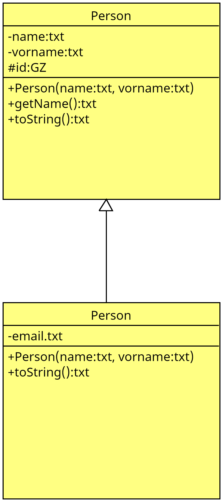

# Beispiel Vererbung

## Aufgabe
1. Erstellen Sie die Klassen aus dem UML-Diagramm `KD.uxf`. 
2. Erstellen Sie die Schüler `Max Meier` und `Detlef Soost` mit der EMailadresse `ds@web.de`.
3. Geben Sie alle Daten aller Schüler auf der Konsole aus.
4. Packen Sie alle Schülerobjekte in eine Liste / Array o.ä.